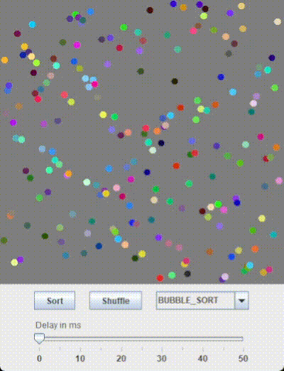

# Data Visualizer

<!-- TOC -->

* [Introduction](#introduction)
* [Preview](#preview)
* [Project setup and installation](#project-setup-and-installation)
* [License](#license)

<!-- TOC -->

## Introduction

One of the best ways to understand how algorithms work is visualizing data as the algorithm acts on it.
I made a Java Swing based GUI that Visualizes the data along with some basic Sorting algorithms to choose from
with more planned to be added in the future.

## Preview



## Project setup and installation

This project is made on OpenJDK 20 and hence should work on Java 20+. Clone the project and run the Main class in
the default package. To use the project perform the following steps in terminal/cmd

```shell
git clone https://github.com/NavjotSRakhra/DataVisualizer.git
cd DataVisualizer\src
javac -d ..\out Main.java
cd ..\out
java Main

```

- Click `Sort` button to start sorting
- Click `Shuffle` button to start shuffle and create a new instance of array
- Select the sorting algorithm from the drop-down list
- You can set the speed of the visualization by selecting the delay(in millisecond) after each sorting action on the
  slider.

## License

MIT License

Copyright (c) 2023 Navjot Singh Rakhra

Permission is hereby granted, free of charge, to any person obtaining a copy
of this software and associated documentation files (the "Software"), to deal
in the Software without restriction, including without limitation the rights
to use, copy, modify, merge, publish, distribute, sublicense, and/or sell
copies of the Software, and to permit persons to whom the Software is
furnished to do so, subject to the following conditions:

The above copyright notice and this permission notice shall be included in all
copies or substantial portions of the Software.

THE SOFTWARE IS PROVIDED "AS IS", WITHOUT WARRANTY OF ANY KIND, EXPRESS OR
IMPLIED, INCLUDING BUT NOT LIMITED TO THE WARRANTIES OF MERCHANTABILITY,
FITNESS FOR A PARTICULAR PURPOSE AND NONINFRINGEMENT. IN NO EVENT SHALL THE
AUTHORS OR COPYRIGHT HOLDERS BE LIABLE FOR ANY CLAIM, DAMAGES OR OTHER
LIABILITY, WHETHER IN AN ACTION OF CONTRACT, TORT OR OTHERWISE, ARISING FROM,
OUT OF OR IN CONNECTION WITH THE SOFTWARE OR THE USE OR OTHER DEALINGS IN THE
SOFTWARE.
